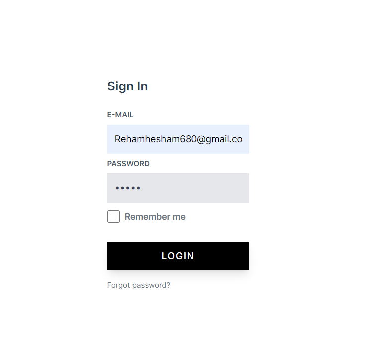

## About Skills Project

> Using Laravel "Swagger" & VUE "Pinia & Axios & Tailwind"

- API 
  - Skills CRUD Operations 
  - Skills "Full Text" Search 
  - Authentication Operations
- API documentation
  - use Swagger to make API documentation

- Fetch API
  - Use Axios for fetching data 
- State Management
  - Use Pinia for state management
- Routing
  - Check authentication for routes
- Real Time Search
  - Using key event to handle issue of "request every character typed for search"

  

